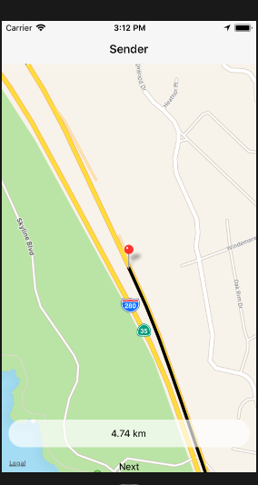
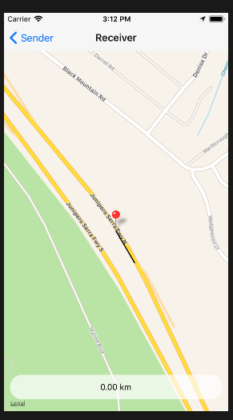

# Tracker-app
This app is built with the help of React native and PUBNUB framework.
### Sender

### Reciever 



###
An app build using React native for dynamic location tracking. You can install this app in your device and can track location of anyone who is connected to your channel.

Clone the repository and use the Profile you want to use i.e Sender/Receiver


## Clone this repository and follow these steps;

### Requirement 
1. XCode 
2. VS code

```
npm install
```
 ```
 cd ios
 pod install 
 ```
```
react-native run-ios (for iOS)
```

```
react-native run-android (for android)
```
